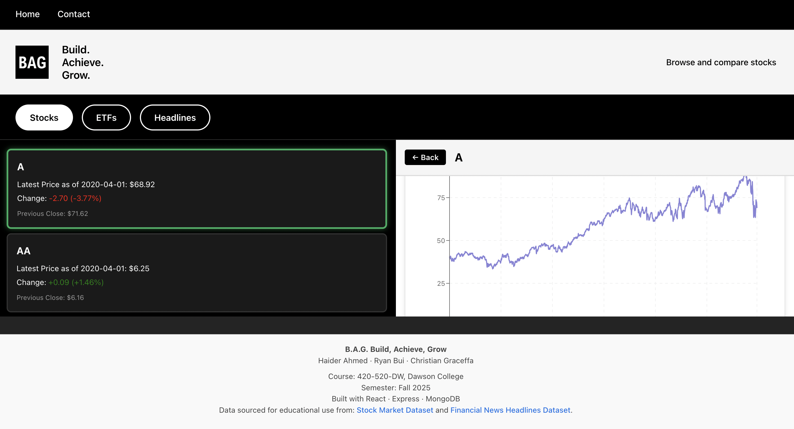
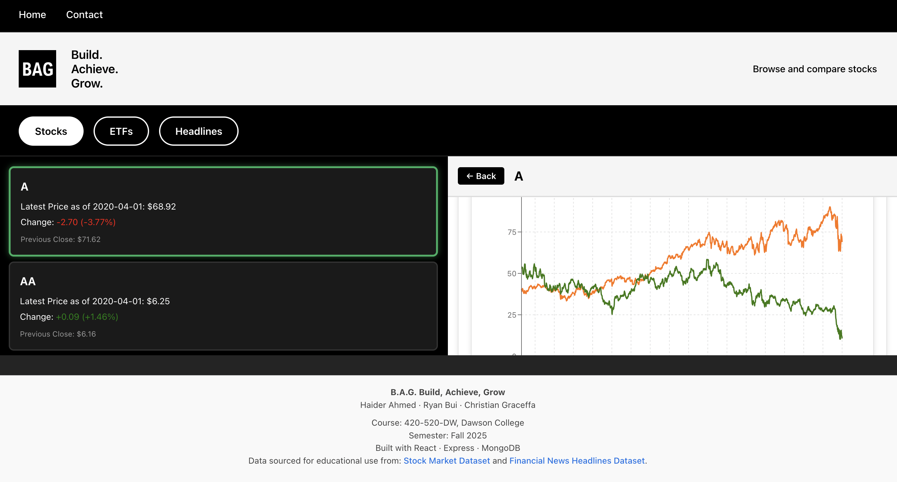
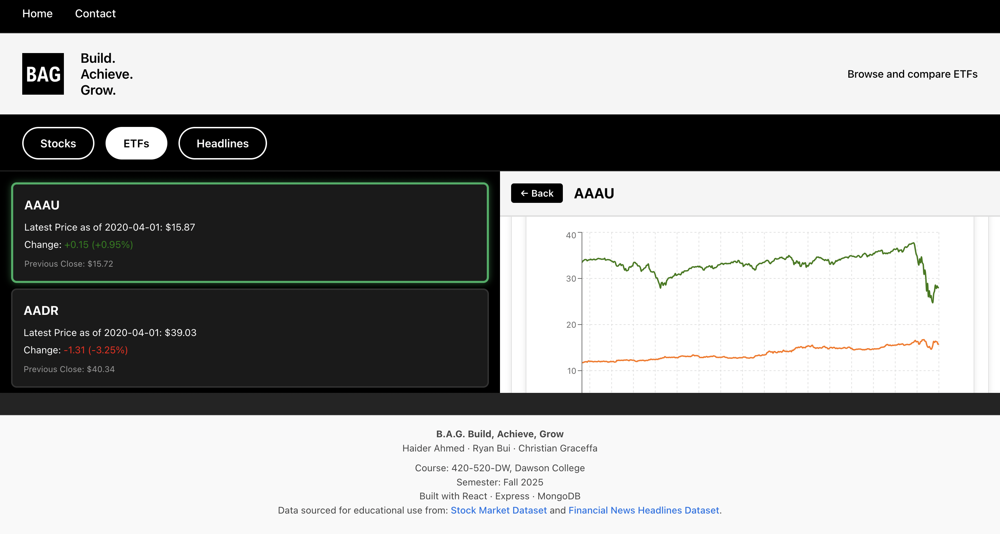
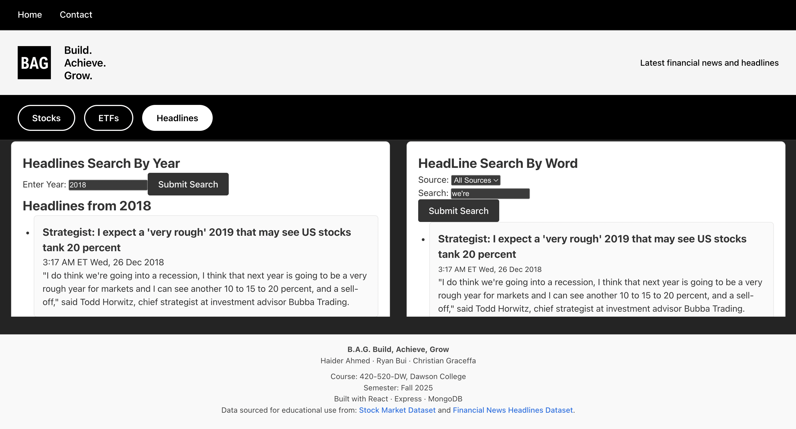
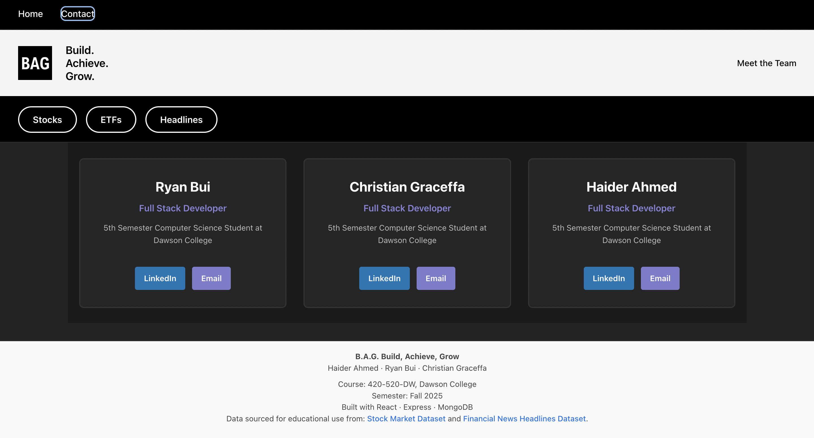

# Web Project – B.A.G. (Build, Achieve, Grow)
**Course:** 420-520-DW  
**Semester:** Fall 2025  
**Team Members:**  
- Ryan Bui (Checker)
- Haider Ahmed (Coordinator)
- Christian Graceffa (Monitor)

---

## Description
The **B.A.G.** is a full-stack **Express + React** web application that visualizes the performance of major **Exchange-Traded Funds (ETFs)** from multiple industries, including **Technology, Finance, Energy, and Healthcare**.  

Users can explore and compare trends across industries, view live or historical performance data, and access summaries and insights for each ETF.  
As developers, our goal is to provide a clean, fast, and interactive interface that helps users understand how different sectors are performing in global markets.

All core data is processed on the **Express server** and stored in **MongoDB**, while the **React client** handles visualization, filtering, and dynamic interactions.

---

### Implemented Deliverables
**Client-Side**
- React Components:
  - PriceCard, PriceGrid, PriceDetail, PriceChart
  - EtfCard, EtfGrid, EtfDetail, EtfChart
  - StockCard, StockGrid, StockDetail, StockChart
  - HeadlineList, NewsFeed, CompareChart, SearchBar, Footer
- Interactive visualizations using Recharts.
- Routing & Interaction: Clickable cards to access detailed chart views.
- Error & Loading States: Friendly UI messages and fail-gracefully design.
- Accessibility and semantic layout.

**Server-Side**
- Express Endpoints:
  - /api/stocks, /api/stocks/:symbol, /api/stocks/:symbol/latest, api/stocks/:symbol/prev-close
  - /api/etfs, /api/etfs/:symbol, /api/etfs/:symbol/latest, api/etfs/:symbol/prev-close
  - /api/headlines, /headlines/:source
- Swagger Documentation: Accessible at /docs with OpenAPI annotations.
- Unit Tests: Mocha/Chai/Supertest suites for etfs.js and stocks.js.
- CI/CD Integration: GitLab CI pipeline runs linting, build, and tests.
- Bundle Size Monitoring: bundlesize2 tracks JS/CSS build weights.

## Project Structure
```bash
project-root/
├── client/
│   ├── public/
│   └── src/
│       ├── assets/
│       ├── components/
│       │   ├── CompareChart.jsx
│       │   ├── EtfCard.jsx
│       │   ├── EtfChart.jsx
│       │   ├── EtfGrid.jsx
│       │   ├── Footer.jsx
│       │   ├── Footer.css
│       │   ├── HeadlineList.jsx
│       │   ├── NewsFeed.jsx
│       │   ├── SearchBar.jsx
│       │   ├── StockCard.jsx
│       │   ├── StockChart.jsx
│       │   └── StockGrid.jsx
│       │
│       ├── views/
│       │   ├── CompareEtfs.jsx
│       │   ├── CompareStocks.jsx
│       │   ├── EtfDetail.jsx
│       │   ├── Home.jsx
│       │   ├── NewsPage.jsx
│       │   └── StockDetail.jsx
│       │
│       ├── App.jsx
│       ├── App.css
│       ├── index.css
│       └── main.jsx
│
├── server/
│   ├── routes/
│   ├── db/
│   ├── utils/
│   ├── test/
│   ├── swagger.js
│   └── bin/www
│── performance.md
├── package.json
└── .gitlab-ci.yml
```

## Data Sources and Attributions
This project uses public datasets from Kaggle for educational purposes only:

- Stock Market Dataset by jacksoncrow: https://www.kaggle.com/datasets/jacksoncrow/stock-market-dataset
- Financial News Headlines Dataset by ankurzing: https://www.kaggle.com/datasets/ankurzing/sentiment-analysis-for-financial-news

**Libraries and Tools:** React, Express, MongoDB, Recharts, Mocha/Chai/Supertest, Swagger UI, bundlesize2

## API Documentation
[Swagger DOCS](http://localhost:3000/docs)

## Deployment URLs

AWS Lightsail (HTTP only):
[AWS Lightsail](http://16.52.160.193/)

Render Deployment (HTTPS, HTTP/2):
<enter here if made>

## How to re-deploy AWS LightSail
1) Create Lightsail Instance
- Go to https://collegedawson.awsapps.com/start/
- Open AWS Lightsail → Create Instance
- Region: ca-central-1
- Platform: Linux/Unix
- Blueprint: Node.js (Bitnami)
- Create custom SSH key → name: 2025-520-yourname
- Download the .pem file (the .pem file needs to be in the same location for the terminal meaning if you are in the directory of Desktop .pem has to be in there, if not it will not work.)
- Instance name: 2025-520-BAG-Ahmed-Bui-Graceffa
- Add tag: 2025-520
- Create instance

2) SSH Into Instance
ssh -i ~/2025-520-yourname.pem bitnami@<INSTANCE_IP>

3) Configure MongoDB Atlas
- Go to MongoDB Atlas
- Security → Network Access
- Add IP Address → add your AWS instance public IP

4) Build Production Version Locally
git clone [BAG_repo](https://gitlab.com/dawson-cst-cohort-2026/520/section2/teams/TeamM-23-ChristianHaiderRyan/520-project-bui-ahmed-graceffa.git) bag_deploy
cd bag_deploy

cd client
npm ci
npm run build

cd ../server
npm ci --omit dev

cd ..

5) Create Deployment Archive
tar -czvf bag.tar.gz server client

6) Copy Archive to AWS
scp -i ~/2025-520-yourname.pem bag.tar.gz bitnami@<INSTANCE_IP>:~

7) SSH Into AWS Again
ssh -i ~/2025-520-yourname.pem bitnami@<INSTANCE_IP>

8) Extract Deployment on AWS
tar -xzvf bag.tar.gz
mv server ~/bag/server
mv client ~/bag/client

(OR place it where you want your app directory to live)

9) Create .env on AWS
cd ~/bag/server
nano .env

Add:
ATLAS_URI= just mongo db string that we get to connect to the clustor
Save and exit.

10) Install pm2 on AWS
sudo npm install -g pm2@latest

11) Start the Express Server
cd ~/bag/server
NODE_ENV=production PORT=3001 pm2 start bin/www

pm2 list
pm2 logs

12) Configure Apache Reverse Proxy (Bitnami)
sudo nano /opt/bitnami/apache/conf/vhosts/bag.conf

Paste:
<VirtualHost 127.0.0.1:80 _default_:80>
  ProxyPass / http://localhost:3001/
  ProxyPassReverse / http://localhost:3001/
</VirtualHost>

Save + exit.

13) Restart Apache
sudo /opt/bitnami/ctlscript.sh restart apache

14) Test Deployment
Visit:
http://<INSTANCE_IP>

Your B.A.G. project should now load on AWS Lightsail.


## Running the Client (Development)
```bash
cd server
node bin/www
cd ..
cd client
npm install
npm run dev
```

## Seeding the database 
```bash
cd server
node utils/seed.js
```

## Running in production
```bash
# Build the React client
cd client
npm install
npm run build

# Go back to project root and install server deps
cd ../server
npm install

# Start the server (serves both API + built client)
npm start
```
## Running the tests
```bash
cd server/test
npm test
```

## Screenshots








## Acknowledgements
This project was developed for Dawson College, Computer Science Technology (420-520-DW) by Haider, Ryan, Christian
under the supervision of Maja Frydrychowicz.